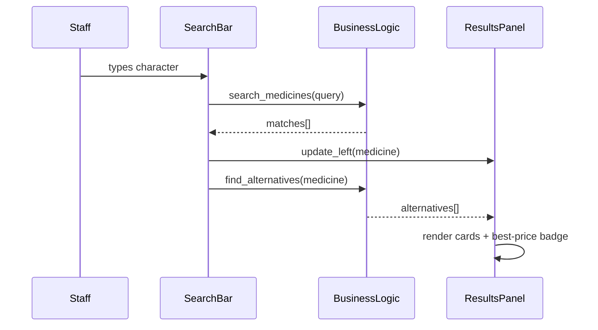

# Design Document — MedMatch

## Overview

MedMatch is a single-file Python/Tkinter desktop application for pharmacy staff. It loads a CSV file of medicine records into memory at startup, then lets staff type a medicine name and instantly see cheaper, in-stock alternatives that share the same active formula.

The application has no network dependency, no login, and no external runtime beyond Python 3's standard library. All business logic lives in `medmatch.py`; all data lives in `medicines.csv`.

### Key Design Decisions

- **Single-file application**: The entire app is `medmatch.py`. This keeps deployment trivial (copy two files, run one command) and matches the stated tech-stack constraints.
- **In-memory data**: The CSV is loaded once at startup into a list of `Medicine` dataclass instances. All search and filter operations are pure Python list comprehensions over this list — no database, no file I/O during normal use.
- **Tkinter only**: No third-party GUI library. Tkinter is part of the Python standard library; no `pip install` step is needed.
- **Separation of concerns inside a single file**: The file is organized into clearly delineated sections — data model, CSV layer, business logic layer, and UI layer — so each can be tested and understood independently even though they share a module.

---

## Architecture

The application is divided into four logical layers that communicate top-down:

```
┌──────────────────────────────────────────┐
│              UI Layer                    │
│  MainWindow  SearchBar  MedicineCard     │
│  AlternativesPanel  ResultsPanel         │
└────────────────┬─────────────────────────┘
                 │  calls
┌────────────────▼─────────────────────────┐
│           Business Logic Layer           │
│  search_medicines()  find_alternatives() │
│  best_price_indices()  format_price()    │
│  normalize_manufacturer()                │
└────────────────┬─────────────────────────┘
                 │  reads
┌────────────────▼─────────────────────────┐
│            CSV / Data Layer              │
│  load_csv()  parse_row()                 │
└────────────────┬─────────────────────────┘
                 │  persists
┌────────────────▼─────────────────────────┐
│           Data Model Layer               │
│  Medicine (dataclass)                    │
└──────────────────────────────────────────┘
```

**Data flow at startup:**
1. `load_csv()` reads `medicines.csv`, calls `parse_row()` for each row, collects valid `Medicine` instances into the global `medicine_db: list[Medicine]`.
2. `MainWindow` is constructed, receives the `medicine_db` list.
3. `MainWindow` is displayed; `SearchBar` is enabled.

**Data flow on each keystroke:**
1. `SearchBar` fires `on_search(query: str)`.
2. `on_search` calls `search_medicines(query, medicine_db)` → list of matching `Medicine`.
3. If the list has exactly one entry, the left panel shows that medicine's card; otherwise a pick-list is shown.
4. When a medicine is selected (single result or pick-list selection), `find_alternatives(selected, medicine_db)` is called.
5. Results are passed to `AlternativesPanel` for rendering.



---

## Components and Interfaces

### `Medicine` (dataclass)

```python
@dataclass
class Medicine:
    brand_name:   str
    generic_name: str   # formula / active ingredient
    manufacturer: str
    price_pkr:    float
    quantity:     int
```

All fields are stored in their parsed types. String fields are stripped of leading/trailing whitespace at parse time. `manufacturer` is normalised through `normalize_manufacturer()` before storage.

---

### CSV / Data Layer

#### `load_csv(path: str) -> tuple[list[Medicine], list[str]]`

Returns `(medicines, warnings)`.

- Opens the file with `utf-8-sig` encoding (handles BOM from Excel exports).
- Uses `csv.DictReader` so column order is irrelevant; only column names matter.
- If the file is missing → raises `FileNotFoundError` (caller shows error in UI).
- If the file is unreadable (permissions, encoding) → raises `OSError`.
- If the header row is missing the required columns → raises `ValueError` with a descriptive message.
- For each data row calls `parse_row(row_number, row_dict)`.

**Required column names (case-sensitive in header):**
`brand_name`, `generic_name`, `manufacturer`, `price_pkr`, `quantity`

#### `parse_row(row_number: int, row: dict) -> Medicine | None`

- Returns a `Medicine` on success; returns `None` and appends a warning string on any parse failure.
- Validates `price_pkr` is convertible to `float` and `>= 0`.
- Validates `quantity` is convertible to `int`; if not, treats it as `0`.
- Strips all string fields; passes `manufacturer` through `normalize_manufacturer()`.
- Skips the row (returns `None`) if `brand_name`, `generic_name`, or `price_pkr` is empty or invalid.

---

### Business Logic Layer

#### `search_medicines(query: str, db: list[Medicine]) -> list[Medicine]`

- Returns empty list if `query` is empty or whitespace-only.
- Returns all medicines whose `brand_name` contains `query` as a case-insensitive substring.
- Pure function — no side effects.

#### `find_alternatives(selected: Medicine, db: list[Medicine]) -> list[Medicine]`

- Returns medicines from `db` where:
  - `generic_name.lower() == selected.generic_name.lower()`
  - `price_pkr < selected.price_pkr`
  - `quantity > 0`
  - Not the same record as `selected` (identity check by all fields)
- Returns list sorted ascending by `price_pkr`.
- If `selected.price_pkr` is not a valid positive float, returns empty list.
- Pure function — no side effects.

#### `best_price_indices(alternatives: list[Medicine]) -> list[int]`

- Returns a list of all indices in `alternatives` that share the minimum `price_pkr`.
- Returns empty list if `alternatives` is empty.
- Pure function.

#### `format_price(price: float) -> str`

- Returns `f"{price:.2f} PKR"`.
- Example: `1250.0` → `"1250.00 PKR"`.

#### `normalize_manufacturer(value: str) -> str`

- Returns `"Unknown Manufacturer"` if `value` stripped is empty.
- Otherwise returns the stripped value.

#### `price_difference(selected_price: float, alternative_price: float) -> float`

- Returns `selected_price - alternative_price`.
- Caller is responsible for only calling this when `alternative_price < selected_price`.

---

### UI Layer

All UI components are Tkinter widgets. They are organized as a class hierarchy inside `medmatch.py`.

#### `MainWindow(tk.Tk)`

- Root window, title `"MedMatch"`, background `COLOR_BG`.
- On `__init__`: calls `load_csv()`, handles exceptions (shows `ErrorBanner`, disables search bar).
- Constructs `SearchBar` and `ResultsPanel` as child widgets.
- Passes `medicine_db` to `SearchBar` via constructor.

#### `SearchBar(tk.Frame)`

- Contains a single `ttk.Entry` widget.
- Binds `<KeyRelease>` → `_on_key_release`.
- `_on_key_release`: debounces with `after(50, ...)`, then calls `search_medicines(query, db)`.
  - 0 results → clears `ResultsPanel`, shows "No results found" in left column.
  - 1 result → calls `ResultsPanel.show_medicine(match)`.
  - >1 results → calls `ResultsPanel.show_picklist(matches)`.

#### `ResultsPanel(tk.Frame)`

- Two-column frame: `_left_frame` and `_right_frame`, each `minwidth=300`.
- `show_medicine(medicine: Medicine)`: renders `MedicineCard` in left frame, calls `find_alternatives`, renders `AlternativesPanel` in right frame.
- `show_picklist(matches: list[Medicine])`: renders a `tk.Listbox` in left frame; on selection fires `show_medicine`.
- `clear()`: destroys all child widgets in both frames.

#### `MedicineCard(tk.Frame)`

A read-only display widget for one medicine in the left column.

```
┌──────────────────────────┐
│  Panadol Extra           │  ← brand_name (bold, navy)
│  Paracetamol 500mg       │  ← generic_name
│  GSK Pakistan            │  ← manufacturer
│  125.00 PKR              │  ← price (formatted)
└──────────────────────────┘
```

#### `AlternativeCard(tk.Frame)`

Used in the right column for each alternative.

```
┌──────────────────────────┐
│ [BEST PRICE]             │  ← badge (green, only if best)
│  Disprin                 │  ← brand_name
│  Reckitt Benckiser       │  ← manufacturer
│  85.00 PKR               │  ← price
│  Rs. 40.00 cheaper       │  ← price difference
└──────────────────────────┘
```

#### `AlternativesPanel(tk.Frame)`

- Contains a `tk.Canvas` + `tk.Scrollbar` + inner `tk.Frame` for scrollable list.
- Renders zero or more `AlternativeCard` widgets.
- If `alternatives` is empty → shows label `"No cheaper alternatives found"`.
- Calls `best_price_indices()` and passes badge flag to each `AlternativeCard`.

#### `ErrorBanner(tk.Label)`

- Renders as a red-background label in `MainWindow`.
- Shown when CSV fails to load; hides once a valid CSV is loaded (not in v1 — v1 is startup-only error).

---

## Data Models

### `Medicine` dataclass (full definition)

```python
from dataclasses import dataclass

@dataclass(frozen=True)
class Medicine:
    brand_name:   str    # trade name, e.g. "Panadol Extra"
    generic_name: str    # active formula, e.g. "Paracetamol 500mg"
    manufacturer: str    # e.g. "GSK Pakistan" or "Unknown Manufacturer"
    price_pkr:    float  # non-negative; e.g. 125.00
    quantity:     int    # stock units; 0 means out of stock
```

`frozen=True` makes instances hashable and prevents accidental mutation. The business logic layer treats `Medicine` objects as value types.

### In-memory database

```python
medicine_db: list[Medicine] = []
```

Populated at startup by `load_csv()`. Never modified after that. All query functions receive it as a parameter.

### CSV Schema

| Column | Type | Constraints |
|---|---|---|
| `brand_name` | string | Non-empty |
| `generic_name` | string | Non-empty |
| `manufacturer` | string | May be empty → normalized to "Unknown Manufacturer" |
| `price_pkr` | float | Non-negative decimal |
| `quantity` | int | Non-negative; invalid → treated as 0 |

### Warning log

```python
parse_warnings: list[str] = []
```

Each entry is a human-readable string like:
`"Row 14: invalid price_pkr value 'abc' — row skipped."`

---

## Correctness Properties

*A property is a characteristic or behavior that should hold true across all valid executions of a system — essentially, a formal statement about what the system should do. Properties serve as the bridge between human-readable specifications and machine-verifiable correctness guarantees.*

This feature uses **Hypothesis** (Python property-based testing library) for all property tests. Each property test runs a minimum of 100 iterations.

---

### Property 1: Search Inclusion/Exclusion

*For any* list of `Medicine` records and any non-empty search query string, `search_medicines(query, db)` must return exactly those medicines whose `brand_name` contains `query` as a case-insensitive substring — no more, no fewer. If no medicines match, the result is an empty list.

**Validates: Requirements 2.3, 2.7**

---

### Property 2: Medicine Card Renders All Required Fields

*For any* `Medicine` object, the rendered card widget (or the string representation produced by the card's data-extraction function) must contain: the `brand_name`, `generic_name`, `manufacturer`, and `format_price(price_pkr)` — each present and in that display order (brand first, price last).

**Validates: Requirements 3.1, 9.1, 9.2**

---

### Property 3: Alternatives Query Correctness

*For any* `Medicine` record `selected` and any list of `Medicine` records `db`, `find_alternatives(selected, db)` must return exactly those medicines in `db` satisfying all three of: (a) `generic_name` matches `selected.generic_name` case-insensitively, (b) `price_pkr` is strictly less than `selected.price_pkr`, and (c) `quantity > 0`. The returned list must be sorted in non-decreasing order by `price_pkr`.

**Validates: Requirements 4.1, 4.2, 4.4, 11.1, 11.2**

---

### Property 4: Price Difference Is Positive and Accurate

*For any* `selected` medicine and any alternative produced by `find_alternatives(selected, db)`, the price difference must equal `selected.price_pkr - alternative.price_pkr` and must be strictly greater than zero.

**Validates: Requirements 4.5**

---

### Property 5: CSV Round-Trip Integrity

*For any* valid `Medicine` record, formatting its fields into a CSV row (as comma-separated strings) and re-parsing that row through `parse_row()` must produce a `Medicine` with character-for-character identical `brand_name`, `generic_name`, and `manufacturer` values, and a numerically equal `price_pkr` value.

**Validates: Requirements 5.2, 6.1, 6.3**

---

### Property 6: Invalid Row Is Skipped and Warning Is Logged

*For any* CSV row in which one or more required fields (`brand_name`, `generic_name`, `price_pkr`) is absent or non-parseable, `parse_row()` must return `None` (the row is excluded from the database) and must produce at least one warning string that contains the row number and identifies the problematic field.

**Validates: Requirements 5.3, 6.2**

---

### Property 7: Price Formatting Consistency

*For any* non-negative float `price`, `format_price(price)` must return a string matching the pattern `^\d+\.\d{2} PKR$` — a numeric part with exactly two decimal places followed by a space and the currency symbol `PKR`.

**Validates: Requirements 7.5**

---

### Property 8: Manufacturer Normalization

*For any* string `value`, `normalize_manufacturer(value)` must return `"Unknown Manufacturer"` if and only if `value.strip()` is the empty string; otherwise it must return `value.strip()` unchanged.

**Validates: Requirements 9.3**

---

### Property 9: Best Price Label Accuracy

*For any* non-empty list of `Medicine` alternatives, `best_price_indices(alternatives)` must return a non-empty list containing exactly all indices `i` where `alternatives[i].price_pkr == min(a.price_pkr for a in alternatives)`, and no other indices.

**Validates: Requirements 10.1, 10.3, 10.5**

---

### Property 10: Invalid Quantity Treated as Zero

*For any* CSV row where the `quantity` field is missing, empty, or non-numeric, `parse_row()` must produce a `Medicine` record with `quantity == 0`, causing it to be excluded from `find_alternatives()` results.

**Validates: Requirements 11.3, 11.1**

---

## Error Handling

| Condition | Detection Point | Behavior |
|---|---|---|
| `medicines.csv` not found | `load_csv()` at startup | `FileNotFoundError` caught in `MainWindow.__init__`; `ErrorBanner` shown with expected path; `SearchBar` disabled |
| `medicines.csv` unreadable | `load_csv()` at startup | `OSError` / `PermissionError` caught; `ErrorBanner` shown with path + reason; `SearchBar` disabled |
| Missing required header columns | `load_csv()` header check | `ValueError` raised; caught in `MainWindow.__init__`; error message shown; `SearchBar` disabled |
| Row missing required field | `parse_row()` per row | Row skipped; warning appended to `parse_warnings`; loading continues |
| Row with invalid price | `parse_row()` per row | Row skipped; warning appended |
| Row with invalid/missing quantity | `parse_row()` per row | `quantity` set to `0`; row is included but excluded from alternatives |
| Selected medicine has invalid price | `find_alternatives()` | Returns empty list; UI shows "No cheaper alternatives found" |
| Empty search query | `search_medicines()` | Returns `[]`; UI clears both panels |
| No search matches | `search_medicines()` | Returns `[]`; UI shows "No results found" in left column |

Parse warnings are stored in `parse_warnings` (module-level list) and may be displayed in a collapsible info banner or written to `stderr` — the exact presentation is a UI polish decision, but the warnings must be produced regardless.

---

## Testing Strategy

### Overview

Testing is split into two complementary layers:

1. **Unit tests** (in `tests/test_medmatch.py`) — specific examples, error conditions, and integration points.
2. **Property tests** (in `tests/test_properties.py`) — universal properties validated across hundreds of generated inputs using **Hypothesis**.

The business logic functions (`search_medicines`, `find_alternatives`, `best_price_indices`, `format_price`, `normalize_manufacturer`, `parse_row`) are pure or nearly-pure functions, making them ideal targets for both layers.

The UI layer (Tkinter widgets) is tested via smoke/manual tests only, since Tkinter's event loop is not easily driven in headless CI. UI smoke tests verify widget creation without rendering.

### Property-Based Tests (Hypothesis)

Each property from the Correctness Properties section maps to exactly one Hypothesis test. All property tests are configured with `@settings(max_examples=100)` at minimum.

Tag format for each test: `# Feature: medmatch, Property N: <property_text>`

**Generators needed:**
- `medicine_strategy()` — `st.builds(Medicine, ...)` with constrained fields (non-empty brand/generic, float price 0–999999, int quantity 0–9999, valid manufacturer string)
- `medicine_list_strategy()` — `st.lists(medicine_strategy(), min_size=0, max_size=50)`
- `query_strategy()` — `st.text(min_size=1, max_size=30)`
- `price_strategy()` — `st.floats(min_value=0.0, max_value=999999999.99, allow_nan=False, allow_infinity=False)`
- `manufacturer_strategy()` — `st.one_of(st.text(), st.just(""), st.just("   "))` for normalization tests

```python
# Example: Property 1
@given(db=medicine_list_strategy(), query=query_strategy())
@settings(max_examples=100)
def test_search_inclusion_exclusion(db, query):
    # Feature: medmatch, Property 1: search inclusion/exclusion
    results = search_medicines(query, db)
    # Every result must contain query as case-insensitive substring
    for m in results:
        assert query.lower() in m.brand_name.lower()
    # Every medicine whose name contains query must be in results
    expected = [m for m in db if query.lower() in m.brand_name.lower()]
    assert sorted(results, key=lambda m: m.brand_name) == sorted(expected, key=lambda m: m.brand_name)
```

### Unit Tests

| Test | Validates |
|---|---|
| `test_load_csv_missing_file` | Req 1.3 — FileNotFoundError on missing CSV |
| `test_load_csv_unreadable` | Req 1.4 — OSError on unreadable file |
| `test_load_csv_missing_header` | Req 5.5 — ValueError on missing header |
| `test_search_empty_query_clears` | Req 2.6 — empty query returns [] |
| `test_single_match_shows_details` | Req 2.4 — single match populates left panel |
| `test_multiple_matches_shows_picklist` | Req 2.5 — multiple matches show pick list |
| `test_no_alternatives_message` | Req 4.4 — "No cheaper alternatives found" label |
| `test_clear_search_resets_panels` | Req 7.4 — clear resets both columns |
| `test_headings_present` | Req 3.2, 4.3 — "Searched Medicine" and "Cheaper Alternatives" headings |
| `test_invalid_price_no_alternatives` | Req 4.6 — invalid price → no alternatives |
| `test_best_price_single_alternative` | Req 10.3 — single alt gets badge |
| `test_no_best_price_when_no_alternatives` | Req 10.4 — no badge when no alternatives |

---

## Color Palette and UI Theming

All color constants are defined at the top of `medmatch.py` as module-level constants:

```python
# --- Theme Constants ---
COLOR_BG          = "#F8FAFC"   # Window background (near-white)
COLOR_PRIMARY     = "#1E3A5F"   # Primary navy (headings, brand names)
COLOR_GREEN       = "#16A34A"   # Savings green (BEST PRICE badge, price diff)
COLOR_AMBER       = "#D97706"   # Amber (low-stock warning, future use)
COLOR_CARD_BG     = "#FFFFFF"   # Card background
COLOR_BORDER      = "#E2E8F0"   # Card border / separator
COLOR_TEXT_MUTED  = "#64748B"   # Secondary text (manufacturer, formula)
COLOR_BADGE_BG    = "#DCFCE7"   # Light green badge background (BEST PRICE)
COLOR_ERROR_BG    = "#FEE2E2"   # Error banner background

FONT_HEADING      = ("Segoe UI", 11, "bold")
FONT_BODY         = ("Segoe UI", 10)
FONT_MUTED        = ("Segoe UI", 9)
FONT_BADGE        = ("Segoe UI", 8, "bold")

PADDING_CARD      = 10   # px, internal card padding
PADDING_OUTER     = 16   # px, outer window/panel padding
MIN_COLUMN_WIDTH  = 300  # px, minimum width for each results column
```

---

## Folder / File Structure

```
MedMatch/
├── medmatch.py          # Main application — all source code
├── medicines.csv        # CSV data file (40 medicines, seed data)
└── tests/
    ├── test_medmatch.py     # Unit tests (pytest)
    └── test_properties.py   # Property-based tests (pytest + Hypothesis)
```

`tests/` is not required for the application to run; it is only for development and CI. The distributable is just `medmatch.py` + `medicines.csv`.

### Running the Application

```bash
python medmatch.py
```

### Running Tests

```bash
# Unit tests
pytest tests/test_medmatch.py -v

# Property tests (single-run, no watch mode)
pytest tests/test_properties.py -v
```
